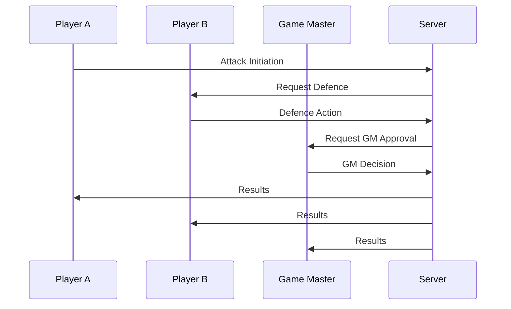

# BURN2

**BURN2** (Battle Utility for Roleplaying Narratives 2) is a rewrite of **BURN**, as it was no longer maintainable. **BURN2** was written to automatize combat in TTRPGs, allowing to run large scale battles quickly and fairly.

## Setup

> [!TIP]
> After initial setup, you can use the following command in the main project directory to automatically run the backend, frontend, and watch shared files:
>
> ```bash
> npm run dev
> ```

### Shared files between front and back

This project uses `copyfiles` to sync types, functions and constants between frontend and backend.

```bash
npm i
npm run sync-files
```

Command `npm run sync-files` copies all files from `shared/*` to `backend/src/shared/*` and to `frontend/src/shared/*`.  
`npm run sync-files` must be run each time files in `shared` are changed.

### Backend and DB

Backend is written in `Node.js with Typescritp`, it uses `nodemon` to watch `src/server.ts` and to reload server on changes.

```bash
cd backend
npm i
npm start
```

Database that BURN2 is using is MongoDB. To run the project, you need to create a .env configuration file in `backend` directory.

1. Create a file named .env in `backend/` folder
2. Copy the required environment variables from the example file (.env.example)
3. Fill in the appropriate values

### Frontend

Frontend is written in `React.js with Typescript`, using `vite`.

```bash
cd frontend
npm i
npm run dev
```

## Sequences

### Attack sequence

| **Action**          | **Description**                                                                       |
| ------------------- | ------------------------------------------------------------------------------------- |
| Attack Initiation   | Player A selects a target and sends an attack request to the server.                  |
| Request Defence     | Server asks Player B (target) to choose a defense type (ie. "DODGE" or "REPOSITION"). |
| Defence Action      | Player B selects defense type and responds to the server.                             |
| Request GM Approval | Server sends attack/defense data to the Game Master (GM) for verification.            |
| GM Decision         | GM approves or modifies the results and sends the decision back.                      |


