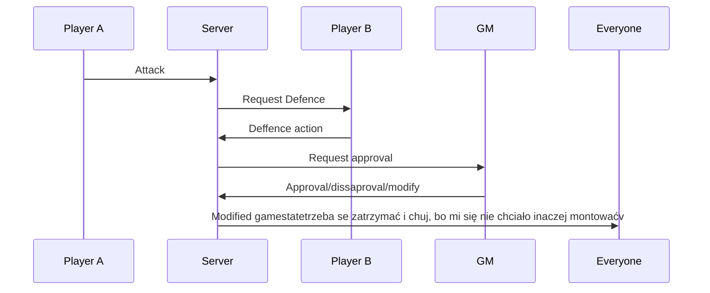

# BURN2

**BURN2** (Battle Utility for Roleplaying Narratives 2) is a rewrite of **BURN**, as it was no longer maintainable. It was written to automatize combat in TTRPGs, allowing to run large scale battles quickly and fairly.

## Setup

### Shared files between front and back

This project uses `copyfiles` to sync types and constants between frontend and backend.

```bash
npm i
npm start
npm run sync-files
```

Command `npm run sync-files` copies all files from `shared/*` to `backend/src/shared/*` and to `frontend/src/shared/*`.  
`npm run sync-files` must be run each time files in `shared` are changed.

### Backend

Backend is written in `Node.js with Typescritp`, it uses `nodemon` to watch `src/server.ts` and to reload server on changes.

```bash
cd backend
npm i
npm start
```

### Frontend

Frontend is written in `React.js with Typescript`, using `vite`.

```bash
cd frontend
npm i
npm run dev
```

## Sequences

### Attack sequence

| **Action** | **Description**                                           |
| ---------- | --------------------------------------------------------- |
| Attack     | Player A attacks Player B by pressing button on frontend. |


